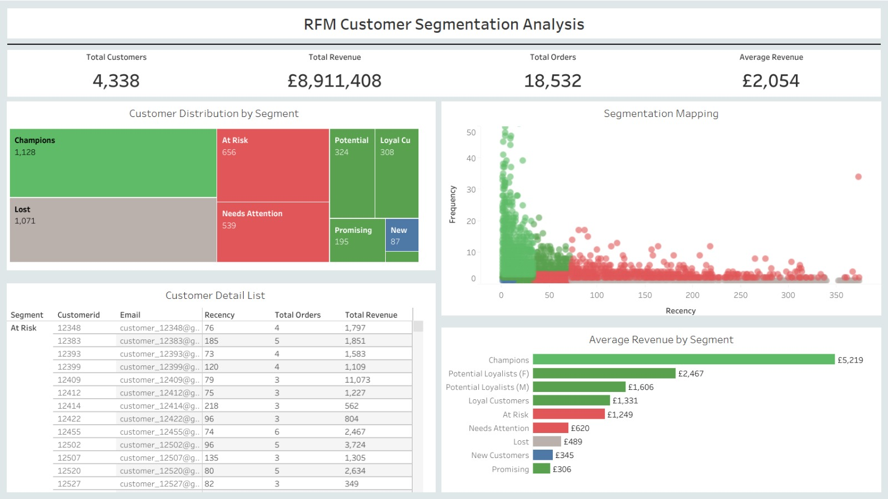

# RFM Customer Segmentation & Retention Strategy 

## Project Overview
Proyek ini mentransformasi **540.000+ data transaksi** ritel online Inggris menjadi strategi loyalitas yang efektif dan retensi yang presisi menggunakan metode **RFM Analysis** (Recency, Frequency, Monetary). Dengan memanfaatkan Python, MySQL, dan Tableau, analisis ini memetakan perilaku konsumen untuk mempertahankan high value customer dan mencegah kehilangan pendapatan akibat *customer churn*.

## Business Problem
Sebagai bisnis *online retail* dengan basis pelanggan yang besar di UK, memahami perilaku setiap individu merupakan tantangan utama. Pendekatan pemasaran yang general menyebabkan inefisiensi biaya. Analisis ini bertujuan untuk memastikan tercapainya:
1.  **Program Loyalitas Efektif:** Mengidentifikasi siapa VIP sebenarnya.
2.  **Strategi Retensi Tepat Sasaran:** Mencegah pelanggan kabur sebelum terlambat.

**Solusi:** Penerapan **RFM Analysis** berbasis *quantile* untuk segmentasi perilaku yang akurat.

---

## Key Insights
* **High-Value Risk:** Temuan paling kritis menunjukkan bahwa segmen **'At Risk'** (pelanggan yang mau pergi) memiliki rata-rata nilai transaksi (*Monetary*) **3.6x lipat lebih tinggi** dibandingkan pelanggan baru (*New Customers*). Kehilangan segmen ini jauh lebih merugikan daripada gagal mendapatkan pelanggan baru.
* **Customer Polarization:** Terjadi polarisasi tajam dalam basis data, di mana pelanggan terbagi ekstrem antara kelompok sangat loyal (*Champions*) dan kelompok yang sudah hilang (*Lost*), menuntut strategi penanganan yang berbeda.
* **Segmentasi Akurat:** Penggunaan metode **Quantile Segmentation** berhasil mengatasi distribusi data yang miring (*skewed*), menghasilkan 9 segmen pelanggan yang proporsional dan realistis dibandingkan metode rata-rata biasa.
* **Pareto Principle:** Sebagian kecil segmen (*Champions* & *Loyal Customers*) berkontribusi pada mayoritas pendapatan perusahaan, mengonfirmasi pentingnya menjaga kepuasan kelompok elit ini.

---

## Strategic Recommendations

#### 1. Retention Strategy (Target: At Risk & Needs Attention)
* **Tindakan:** Melakukan kampanye *win-back* yang personal dan agresif (misal: diskon khusus terbatas waktu atau notifikasi pengingat keranjang).
* **Tujuan:** Menyelamatkan *revenue* dari pelanggan bernilai tinggi (3.6x value) yang hampir churn.

#### 2. Appreciation Strategy (Target: Champions & Loyal Customers)
* **Tindakan:** Memberikan layanan VIP, akses awal produk baru (*early access*), atau *reward* eksklusif. **Hindari pemberian diskon harga** untuk menjaga margin, karena mereka sudah loyal tanpa diskon.
* **Tujuan:** Menjaga kepuasan emosional agar tidak berpindah ke kompetitor.

#### 3. Growth Strategy (Target: New Customer, Promising, & Potential Loyalists)
* **Tindakan:** Implementasi *Cross-selling* (rekomendasi produk pelengkap) dan insentif gamifikasi (poin) untuk pembelian berikutnya.
* **Tujuan:** Mendorong frekuensi belanja dan meningkatkan *Average Order Value* agar "naik kelas" menjadi Loyal.

#### 4. Efficiency Strategy (Target: Lost)
* **Tindakan:** Hentikan alokasi biaya *marketing* dan iklan berbayar untuk segmen ini.
* **Tujuan:** Efisiensi anggaran untuk dialihkan ke segmen prioritas (Retensi & Apresiasi).

---

## Tech Stack
* **Data Processing:** Python (Pandas for Quantile Segmentation & Cleaning).
* **Database Management:** MySQL (Data Extraction & Validation).
* **Data Visualization:** Tableau (Interactive Dashboard & Customer Mapping).
* **Tools:** Microsoft Excel (Preliminary Analysis).

---

## Dashboard Preview

[**Lihat Dashboard Interaktif di Tableau Public**](https://public.tableau.com/views/RFMAnalysis-UKOnlineRetail/Dashboard?:language=en-US&:sid=&:redirect=auth&:display_count=n&:origin=viz_share_link)

---

## Repository Structure
* **datacleaning_eda_rfmsegmentation.ipynb:** Notebook Python yang berisi proses data cleaning, EDA, dan logika segmentasi RFM berbasis quantile.
* **data_preparation.sql:** Script SQL untuk ekstraksi data awal dan validasi integritas transaksi.
* **rfm_presentation.pdf:** Slide presentasi eksekutif yang merangkum metodologi, temuan bisnis (insights), dan rekomendasi strategis.
* **dashboard_rfm.png:** Tampilan pratinjau (preview) dari dashboard interaktif Tableau.
* **online_retail_dataset.zip:** Dataset mentah transaksi ritel online yang digunakan dalam analisis.
